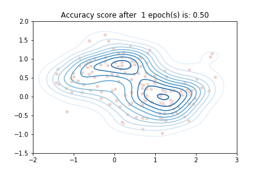

# Artificial_neural_network
**This is a pilot-project to build a basic artificial neural network from scratch, incl. backpropagation learning function**

A feedforward neural network is an artificial neural network wherein connections between the nodes do not form a cycle. As such, it is different from recurrent neural networks.

The feedforward neural network was the first and simplest type of artificial neural network devised. In this network, the information moves in only one direction, forward, from the input nodes, through the hidden nodes (if any) and to the output nodes. There are no cycles or loops in the network.

(Source: wikipedia.com, illustration: learnopencv.com)

## This is a visualisation of the learning process

